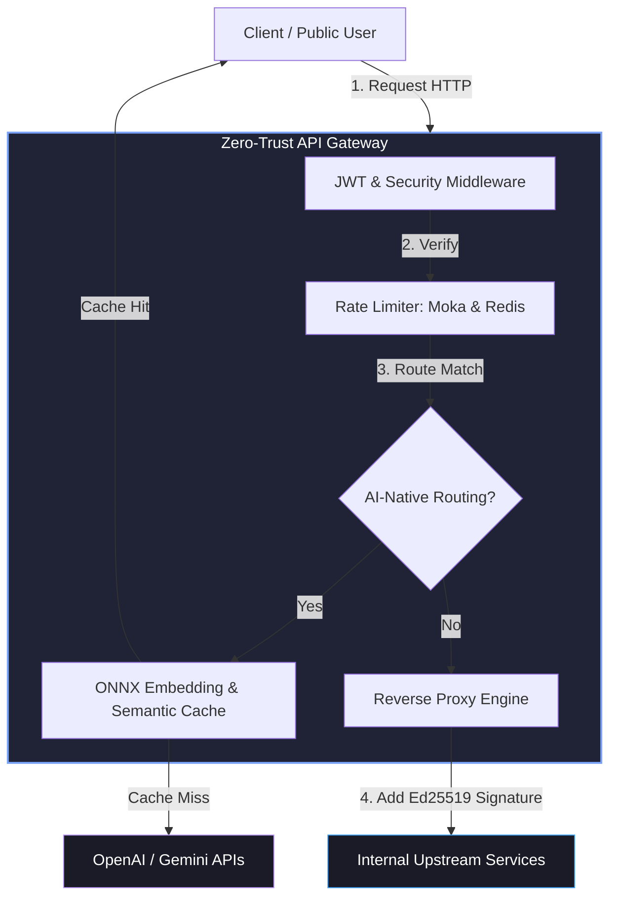

# ⚡ Zero-Trust API Gateway & AI-Native Semantic Cache

<p align="center">
  
  
  
  
  
</p>

---

## 🌟 Giới thiệu tổng quan (Overview)

**Zero-Trust API Gateway** là giải pháp cổng kiểm soát bảo mật thế hệ mới hiệu năng cao được viết hoàn toàn bằng **Rust**. Dự án được thiết kế đặc biệt cho mô hình Solo Developer (B2B / Open-Core) giúp tối ưu hóa hiệu năng, giảm thiểu lượng tiêu thụ tài nguyên RAM (chỉ từ 15MB so với 500MB+ của các giải pháp truyền thống như Kong) và tích hợp các tính năng đột phá liên quan đến tối ưu chi phí sử dụng AI (AI-Native).

Hệ thống hoạt động theo triết lý bảo mật tối tân: **"Never Trust, Always Verify"** (Không tin tưởng ai, luôn luôn xác thực).

---

## ✨ Tính năng nổi bật (Key Features)

* **🚀 Lõi hiệu năng vượt trội**: Xây dựng trên nền tảng `Axum 0.8` & `Tokio Async Engine` giúp xử lý hàng trăm ngàn requests/giây với độ trễ tối thiểu (sub-millisecond latency).
* **🔒 Bảo mật Zero-Trust chặt chẽ**:
  * Tích hợp bộ lọc Middleware xác thực JWT mạnh mẽ.
  * Tự động ký số nội bộ (Internal Signature) bằng mật mã bất đối xứng Ed25519 (`ring`) trước khi chuyển tiếp sang mạng nội bộ, ngăn chặn giả mạo nguồn gốc từ bên ngoài.
* **🛡️ Rate Limiting thông minh**: Hỗ trợ thuật toán *Token Bucket* / *Leaky Bucket* cực nhanh qua bộ nhớ đệm `moka` cục bộ, kết hợp đồng bộ hóa đa cụm (cluster) qua `redis`.
* **🧠 Trí tuệ nhân tạo (AI-Native Gateway)**:
  * Tích hợp proxy điều phối luồng truy cập LLM (OpenAI/Gemini).
  * Chạy mô hình Embedding ONNX trực tiếp (offline) tại Gateway bằng `tract-onnx` để phân tích ngữ nghĩa câu hỏi.
  * Bộ đệm ngữ nghĩa **Semantic Cache** giúp tái sử dụng câu trả lời tương tự từ bộ nhớ cục bộ, tiết kiệm tới **70% chi phí gọi API LLM**.
* **📊 Hệ thống Giám sát & Dashboard thời gian thực**:
  * API REST (`GET /admin/metrics`) trả về JSON snapshot các chỉ số hoạt động.
  * Luồng SSE (`GET /admin/events`) phát dữ liệu metrics mỗi 1 giây (Server-Sent Events).
  * Web Dashboard tại `/dashboard` với giao diện Dark Glassmorphism hiện đại: 4 thẻ chỉ số, biểu đồ Chart.js thời gian thực, theo dõi AI Cache Hit/Miss Ratio.
  * RAII Guard (`ActiveRequestGuard`) đảm bảo số liệu `active_requests` chính xác tuyệt đối trong mọi tình huống (bao gồm panic/early return).

---

## 🗺️ Kiến trúc hệ thống (System Architecture)

Dưới đây là mô hình luồng đi của dữ liệu qua Gateway:



---

## 🛠️ Công nghệ sử dụng (Tech Stack)

| Thành phần | Crate Khuyên Dùng | Mô tả kỹ thuật |
| :--- | :--- | :--- |
| **Async Engine** | `tokio 1.52` | Xử lý đa luồng non-blocking cực mạnh |
| **Routing & Server** | `axum 0.8` | Định tuyến API tốc độ cao, type-safe |
| **Security** | `jsonwebtoken 10`, `ring 0.17` | Mã hóa JWT, ký số Ed25519 bảo vệ microservices |
| **Caching/Session** | `moka 0.12`, `redis 1.2` | Cache cục bộ in-memory và phân tán qua Redis |
| **AI Processing** | `tract-onnx 0.21`, `reqwest` | Chạy ONNX embedding và proxy LLM traffic |
| **Monitoring** | `tokio-stream 0.1`, `futures-util 0.3` | SSE real-time stream, metrics telemetry |
| **Static Files** | `tower-http 0.5` (ServeDir) | Phục vụ Web Dashboard tĩnh tại `/dashboard` |

---

## 🚀 Hướng dẫn khởi chạy nhanh (Quick Start)

### 1. Yêu cầu hệ thống (Prerequisites)
* Đã cài đặt **Rust** (bản ổn định mới nhất, tối thiểu `v1.75`).
* (Tùy chọn) Máy chủ **Redis** nếu chạy đa cụm.

### 2. Cài đặt (Installation)
Tải mã nguồn về máy cục bộ:
```bash
git clone https://github.com/Phungthevinh/zero_trust_gateway.git
cd zero_trust_gateway/zero_trust_gateway
```

### 3. Cấu hình (Configuration)
Tạo file cấu hình `config.yaml` tại thư mục gốc của dự án:
```yaml
server:
  host: "0.0.0.0"
  port: 8080

routes:
  - path: "/api/v1/users"
    target: "http://localhost:8081"
  - path: "/api/v1/orders"
    target: "http://localhost:8082"
```

### 4. Biên dịch và chạy (Run)
Khởi chạy Gateway ở chế độ phát triển (Development):
```bash
cargo run
```

Để biên dịch bản Release tối ưu hóa hiệu năng cao nhất:
```bash
cargo build --release
./target/release/zero_trust_gateway
```

### 5. Thử nghiệm hiệu năng & Kiểm tra độ trễ (Latency & Benchmark Testing)
Hệ thống tích hợp sẵn kịch bản kiểm thử đo đạc hiệu năng chuyển tiếp gói tin (Reverse Proxy latency) thông qua mock upstream server chạy ngầm.

* **Chạy thử nghiệm ở chế độ Debug (Chạy phát triển)**:
  ```bash
  cargo test -- --nocapture
  ```
* **Chạy thử nghiệm ở chế độ Release (Tối ưu hiệu năng)**:
  ```bash
  cargo test --release -- --nocapture
  ```

**Báo cáo kiểm thử thực tế trên localhost:**
* **Chế độ Debug (100 requests liên tục):**
  * **Độ trễ trung bình**: **~251.7 μs** (tương đương **~0.25 ms**).
  * **Tỉ lệ thành công**: 100% (HTTP 200 OK).
* **Chế độ Release (100,000 requests liên tục):**
  * **Độ trễ trung bình**: **~75.87 μs** (tương đương **~0.075 ms**).
  * **Tỉ lệ thành công**: 100% (HTTP 200 OK).
  * **Tổng thời gian hoàn thành**: **7.69s**.

### 6. Tải mô hình AI (AI Model Setup)
Để sử dụng tính năng AI-Native (Semantic Cache), cần tải mô hình ONNX embedding:
```bash
# Tạo thư mục chứa model (chạy từ thư mục gốc của repository)
mkdir -p models

# Tải mô hình all-MiniLM-L6-v2 (~86MB)
curl -L -o models/all-MiniLM-L6-v2.onnx https://huggingface.co/Xenova/all-MiniLM-L6-v2/resolve/main/onnx/model.onnx
```

**Kết quả kiểm thử AI Embedding Engine:**
* **Kích thước vector đầu ra**: 384 chiều
* **Cosine Similarity** (2 câu giống ý nghĩa): **0.9907** (99%)
* **Cosine Similarity** (2 câu khác ý nghĩa): **0.8951** (89%)
* **Thời gian xử lý** (load model + embed 3 câu): **~0.65 giây** (chế độ Release)

### 7. Truy cập Web Dashboard (Admin Monitoring)
Sau khi khởi chạy Gateway, mở trình duyệt tại:
```
http://localhost:8080/dashboard
```
Dashboard hiển thị thời gian thực:
* **4 thẻ chỉ số**: Total Requests, Active In-Flight, Errors/Rejects, AI Cache Hit Ratio %
* **Biểu đồ đường Chart.js**: Traffic telemetry cập nhật mỗi 1 giây (30 điểm dữ liệu gần nhất)
* **AI Semantic Cache Breakdown**: Số lần Cache Hit / Miss, thanh tiến trình Cache Efficiency
* **Trạng thái kết nối SSE**: Tự động reconnect khi mất mạng

**API Monitoring (dành cho tích hợp):**
| Endpoint | Phương thức | Mô tả |
| :--- | :--- | :--- |
| `/admin/metrics` | GET | Trả về JSON snapshot tất cả chỉ số |
| `/admin/events` | GET (SSE) | Stream dữ liệu metrics mỗi 1 giây |
| `/health` | GET | Health check, trả về "OK" |

---


## 📅 Tiến độ dự án (Roadmap)
Xem chi tiết trạng thái triển khai tại [PROGRESS.md](PROGRESS.md).

| Giai đoạn | Nội dung | Trạng thái |
| :---: | :--- | :---: |
| **1** | Lõi Reverse Proxy + Config System | 🟢 Hoàn thành |
| **2** | Zero-Trust Security + Rate Limiting | 🟢 Hoàn thành |
| **3** | AI-Native: Embedding Engine + Semantic Cache | 🟢 Hoàn thành |
| **4** | Metrics API, SSE Stream, Web Dashboard, Single Binary | 🟡 Đang thực hiện |

## 🤝 Đóng góp ý kiến (Contributing)
Mọi đóng góp, báo lỗi (issues) và yêu cầu tính năng (PRs) đều được chào đón! Hãy mở một Pull Request hoặc Issue để chúng ta cùng thảo luận.

## 📄 Giấy phép (License)
Dự án được phân phối dưới giấy phép **MIT**. Xem tệp [LICENSE](LICENSE) để biết thêm chi tiết.

---

## 👤 Tác giả (Author)
* **Phùng Thế Vinh** - *Chủ dự án & Nhà phát triển chính* - [@Phungthevinh](https://github.com/Phungthevinh)
* Email liên hệ: ptvstar2003@gmail.com

