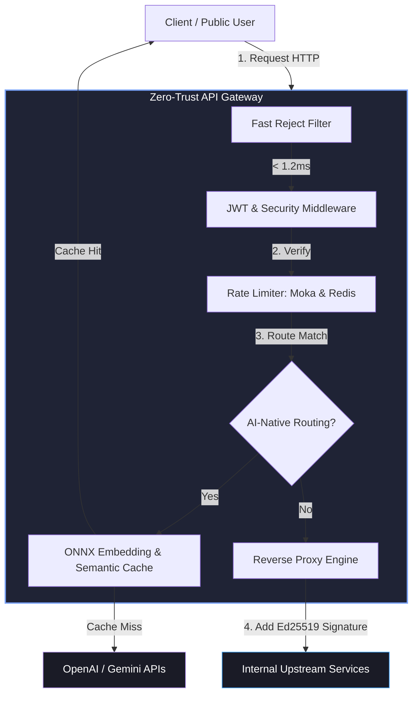

# ⚡ Zero-Trust API Gateway & AI-Native Semantic Cache

<p align="center">
  
  
  
  
  
</p>

---

## 🌟 Giới thiệu tổng quan (Overview)

**Zero-Trust API Gateway** là giải pháp cổng kiểm soát bảo mật thế hệ mới hiệu năng cao được viết hoàn toàn bằng **Rust**. Dự án được thiết kế đặc biệt cho mô hình Solo Developer (B2B / Open-Core) giúp tối ưu hóa hiệu năng, giảm thiểu lượng tiêu thụ tài nguyên RAM (chỉ từ 15MB so với 500MB+ của các giải pháp truyền thống như Kong) và tích hợp các tính năng đột phá liên quan đến tối ưu chi phí sử dụng AI (AI-Native).

Hệ thống hoạt động theo triết lý bảo mật tối tân: **"Never Trust, Always Verify"** (Không tin tưởng ai, luôn luôn xác thực).

Toàn bộ Gateway được đóng gói thành **Single Binary duy nhất** (bao gồm cả Web Dashboard nhúng bên trong) — chỉ cần 1 file `.exe` + 1 file `config.yaml` + thư mục `certs/` là có thể triển khai chạy ngay trên bất kỳ máy chủ nào.

---

## ✨ Tính năng nổi bật (Key Features)

* **🚀 Lõi hiệu năng vượt trội**: Xây dựng trên nền tảng `Axum 0.8` & `Tokio Async Engine` giúp xử lý hàng trăm ngàn requests/giây với độ trễ tối thiểu (sub-millisecond latency).
* **🔒 Bảo mật Zero-Trust chặt chẽ**:
  * Tích hợp bộ lọc Middleware xác thực JWT mạnh mẽ.
  * Tự động ký số nội bộ (Internal Signature) bằng mật mã bất đối xứng Ed25519 (`ring`) trước khi chuyển tiếp sang mạng nội bộ, ngăn chặn giả mạo nguồn gốc từ bên ngoài.
* **⚡ Fast Reject Filter**: Tự động từ chối các request xấu/nghi ngờ trong thời gian siêu nhanh dưới 1.2ms trước khi chúng đi vào pipeline xử lý chính.
* **🛡️ Rate Limiting thông minh**: Hỗ trợ thuật toán *Token Bucket* / *Leaky Bucket* cực nhanh qua bộ nhớ đệm `moka` cục bộ, kết hợp đồng bộ hóa đa cụm (cluster) qua `redis`.
* **🧠 Trí tuệ nhân tạo (AI-Native Gateway)**:
  * Tích hợp proxy điều phối luồng truy cập LLM (OpenAI/Gemini).
  * Chạy mô hình Embedding ONNX trực tiếp (offline) tại Gateway bằng `tract-onnx` để phân tích ngữ nghĩa câu hỏi.
  * Bộ đệm ngữ nghĩa **Semantic Cache** giúp tái sử dụng câu trả lời tương tự từ bộ nhớ cục bộ, tiết kiệm tới **70% chi phí gọi API LLM**.
* **📊 Hệ thống Giám sát & Dashboard thời gian thực**:
  * API REST (`GET /admin/metrics`) trả về JSON snapshot các chỉ số hoạt động.
  * Luồng SSE (`GET /admin/events`) phát dữ liệu metrics mỗi 1 giây (Server-Sent Events).
  * Web Dashboard tại `/dashboard` với giao diện Dark Glassmorphism hiện đại: 4 thẻ chỉ số, biểu đồ Chart.js thời gian thực, theo dõi AI Cache Hit/Miss Ratio.
  * RAII Guard (`ActiveRequestGuard`) đảm bảo số liệu `active_requests` chính xác tuyệt đối trong mọi tình huống (bao gồm panic/early return).
* **📦 Single Binary Deployment**: Toàn bộ Web Dashboard (HTML/CSS/JS) được nhúng trực tiếp vào file thực thi bằng `rust-embed`. Chỉ cần phân phối 1 file binary duy nhất, không cần thư mục `static/` đi kèm.

---

## 🗺️ Kiến trúc hệ thống (System Architecture)

Dưới đây là mô hình luồng đi của dữ liệu qua Gateway:



---

## 🛠️ Công nghệ sử dụng (Tech Stack)

| Thành phần | Crate | Mô tả kỹ thuật |
| :--- | :--- | :--- |
| **Async Engine** | `tokio 1.52` | Xử lý đa luồng non-blocking cực mạnh |
| **Routing & Server** | `axum 0.8` | Định tuyến API tốc độ cao, type-safe |
| **Security** | `jsonwebtoken 10`, `ring 0.17` | Mã hóa JWT RS256, ký số Ed25519 bảo vệ microservices |
| **Caching/Session** | `moka 0.12`, `redis 1.2` | Cache cục bộ in-memory và phân tán qua Redis |
| **AI Processing** | `tract-onnx 0.21`, `reqwest 0.12` | Chạy ONNX embedding và proxy LLM traffic |
| **Monitoring** | `tokio-stream 0.1`, `futures-util 0.3` | SSE real-time stream, metrics telemetry |
| **Embedded Assets** | `rust-embed 8.5` | Nhúng static files (HTML/CSS/JS) vào binary |
| **HTTP Middleware** | `tower 0.4`, `tower-http 0.5` | CORS, tracing, middleware pipeline |

---

## 🚀 Hướng dẫn Cài đặt & Khởi chạy từng bước (Step-by-Step Setup Guide)

> **Hướng dẫn này dành cho tất cả mọi người**, kể cả người chưa từng lập trình. Hãy làm theo từng bước một.

### Bước 1: Cài đặt Rust (Chỉ làm 1 lần)

Rust là ngôn ngữ lập trình mà dự án này được viết bằng. Bạn cần cài Rust để biên dịch (build) mã nguồn thành file chạy được.

**Trên Windows:**
1. Mở trình duyệt, truy cập: https://rustup.rs
2. Nhấn nút **"Download rustup-init.exe"** và chạy file vừa tải.
3. Trong cửa sổ dòng lệnh hiện ra, nhấn **Enter** để cài đặt mặc định.
4. Sau khi cài xong, **đóng tất cả cửa sổ Terminal/PowerShell đang mở** rồi mở lại một cửa sổ mới.
5. Kiểm tra cài đặt thành công bằng cách gõ lệnh:
   ```powershell
   rustc --version
   ```
   Nếu hiện ra dòng giống `rustc 1.xx.x (...)` là đã cài thành công.

**Trên macOS / Linux:**
```bash
curl --proto '=https' --tlsv1.2 -sSf https://sh.rustup.rs | sh
source $HOME/.cargo/env
rustc --version
```

---

### Bước 2: Tải mã nguồn dự án về máy

Mở Terminal (PowerShell trên Windows, Terminal trên macOS/Linux) và gõ:
```bash
git clone https://github.com/Phungthevinh/zero_trust_gateway.git
cd zero_trust_gateway/zero_trust_gateway
```

> **Lưu ý:** Nếu máy bạn chưa có `git`, hãy tải và cài đặt từ https://git-scm.com/downloads trước.

---

### Bước 3: Sinh khóa bảo mật (Chỉ làm 1 lần khi cài mới)

Gateway sử dụng 2 loại khóa mật mã:
- **Khóa Ed25519** (để Gateway tự ký số nội bộ vào mỗi request)
- **Khóa RSA** (để Gateway xác thực JWT token của người dùng)

#### 3a. Sinh khóa Ed25519 bằng công cụ `keygen` tích hợp sẵn:
```bash
cargo run --bin keygen
```
Lệnh này sẽ tự động tạo thư mục `certs/` và file `certs/gateway_private.pk8`.

#### 3b. Sinh cặp khóa RSA cho JWT (dùng OpenSSL):
```bash
# Sinh khóa bí mật RSA 2048-bit
openssl genrsa -out certs/jwt_private.pem 2048

# Trích xuất khóa công khai từ khóa bí mật
openssl rsa -in certs/jwt_private.pem -pubout -out certs/jwt_public.pem
```

> **Lưu ý:** Nếu máy bạn chưa có `openssl`, trên Windows có thể tải từ https://slproweb.com/products/Win32OpenSSL.html. Trên macOS/Linux, `openssl` thường đã có sẵn.

Sau bước này, thư mục `certs/` của bạn sẽ có:
```
certs/
├── gateway_private.pk8    # Khóa Ed25519 (sinh từ keygen)
├── jwt_private.pem        # Khóa bí mật RSA (dùng bởi Auth Service để ký JWT)
└── jwt_public.pem         # Khóa công khai RSA (dùng bởi Gateway để xác thực JWT)
```

---

### Bước 4: Tạo file cấu hình

Nếu trong thư mục dự án chưa có file `config.yaml`, hãy tạo từ file mẫu:
```bash
cp config.yaml.example config.yaml
```
Hoặc trên Windows PowerShell:
```powershell
Copy-Item config.yaml.example config.yaml
```

Sau đó mở file `config.yaml` bằng bất kỳ trình soạn thảo nào (Notepad, VS Code...) để tùy chỉnh:
```yaml
# Cấu hình Máy chủ
server:
  host: "127.0.0.1"        # Lắng nghe địa chỉ localhost
  port: 8080               # Cổng chạy Gateway

# Cấu hình Database
database:
  redis_url: "redis://127.0.0.1:6379"  # (Tùy chọn) URL Redis

# Bảo mật
security:
  jwt:
    secret_key_path: "certs/jwt_public.pem"    # Đường dẫn khóa công khai RSA
    issuer: "your-auth-service"                # Tên nhà phát hành JWT
  zero_trust:
    private_key_path: "certs/gateway_private.pk8"  # Đường dẫn khóa Ed25519
    signature_header: "X-Gateway-Signature"
  fast_reject:
    max_header_count: 50
    max_uri_length: 2048
    max_body_size: 10485760  # 10MB
    blocked_paths:
      - "/wp-admin"
      - "/wp-login"
      - "/.env"
      - "/phpmyadmin"
      - "/.git"
      - "/actuator"
    ip_blacklist:
      - "192.168.1.100"      # Các IP bị chặn
  trusted_proxies:
    - "127.0.0.1"
    - "::1"

# Tích hợp AI (Tùy chọn)
ai_native:
  model_path: "models/all-MiniLM-L6-v2.onnx"
  similarity_threshold: 0.85
  cache_ttl: 3600

# Định tuyến API
routes:
  - path: "/api/v1/users"
    target: "http://127.0.0.1:8081"
    strip_prefix: true
    auth_required: true
    rate_limit:
      max_requests: 100
      per_seconds: 60

  - path: "/api/v1/orders"
    target: "http://127.0.0.1:8082"
    strip_prefix: true
    auth_required: false
    rate_limit:
      max_requests: 50
      per_seconds: 60

  - path: "/api/v1/ai/chat"
    target: "https://api.openai.com/v1/chat/completions"
    strip_prefix: false
    auth_required: true
    ai_caching: true
```

---

### Bước 5: (Tùy chọn) Tải mô hình AI cho Semantic Cache

Nếu bạn muốn sử dụng tính năng AI Semantic Cache (tự động nhận diện câu hỏi trùng lặp), cần tải mô hình ONNX:

**Trên macOS / Linux:**
```bash
mkdir -p models
curl -L -o models/all-MiniLM-L6-v2.onnx \
  https://huggingface.co/Xenova/all-MiniLM-L6-v2/resolve/main/onnx/model.onnx
```

**Trên Windows PowerShell:**
```powershell
New-Item -ItemType Directory -Force -Path models
Invoke-WebRequest -Uri "https://huggingface.co/Xenova/all-MiniLM-L6-v2/resolve/main/onnx/model.onnx" -OutFile "models/all-MiniLM-L6-v2.onnx"
```

> **Lưu ý:** File model có kích thước khoảng ~86MB. Nếu không tải model, Gateway vẫn hoạt động bình thường — chỉ tính năng AI Semantic Cache sẽ bị tắt (Graceful Degradation).

---

### Bước 6: Biên dịch và khởi chạy Gateway

#### Chế độ Phát triển (Development — build nhanh, hiệu năng thấp hơn):
```bash
cargo run
```

#### Chế độ Production (Release — hiệu năng cao nhất, build lâu hơn):
```bash
cargo build --release
```
Sau khi build xong, file thực thi nằm tại: `target/release/zero_trust_gateway` (Linux/macOS) hoặc `target/release/zero_trust_gateway.exe` (Windows).

**Chạy file thực thi:**
```bash
# Linux / macOS
./target/release/zero_trust_gateway

# Windows PowerShell
.\target\release\zero_trust_gateway.exe
```

**Khi khởi động thành công**, Terminal sẽ hiện:
```
Đã tải cấu hình: Config { ... }
--------------------------------------------------
- Máy chủ hoạt động tại: 127.0.0.1:8080
- Mức log: info
- ...
--------------------------------------------------
```

> **⚠️ Lưu ý quan trọng:** Gateway **phải được chạy từ thư mục chứa file `config.yaml` và thư mục `certs/`**. Nếu bạn chạy file `.exe` từ thư mục khác, nó sẽ không tìm thấy file cấu hình và thoát ngay.
>
> **⚠️ Lỗi "AddrInUse" (cổng đang bận):** Nếu bạn thấy lỗi `Only one usage of each socket address...`, nghĩa là đã có một phiên Gateway khác đang chạy trên cổng 8080. Tắt phiên cũ trước:
> ```powershell
> # Windows
> Stop-Process -Name zero_trust_gateway -Force
> # Linux/macOS
> pkill zero_trust_gateway
> ```

---

### Bước 7: Truy cập và sử dụng

Sau khi Gateway chạy thành công, mở **trình duyệt web** (Chrome, Edge, Firefox...) và truy cập các địa chỉ sau:

| Địa chỉ | Mô tả |
| :--- | :--- |
| `http://localhost:8080/dashboard` | 📊 **Web Dashboard quản trị** — Giao diện đồ họa hiển thị các chỉ số real-time |
| `http://localhost:8080/health` | 🏥 **Health Check** — Trả về "OK" nếu Gateway đang hoạt động |
| `http://localhost:8080/admin/metrics` | 📈 **Metrics API** — Trả về JSON chứa tất cả chỉ số hoạt động |
| `http://localhost:8080/admin/events` | 📡 **SSE Stream** — Luồng dữ liệu metrics cập nhật mỗi 1 giây |

#### Web Dashboard hiển thị:
* **4 thẻ chỉ số thời gian thực**: Total Requests, Active In-Flight, Errors/Rejects, AI Cache Hit Ratio %
* **Biểu đồ đường Chart.js**: Traffic telemetry cập nhật mỗi 1 giây (30 điểm dữ liệu gần nhất)
* **AI Semantic Cache Breakdown**: Số lần Cache Hit / Miss, thanh tiến trình Cache Efficiency
* **Trạng thái kết nối SSE**: Tự động reconnect khi mất mạng (● connected / ● reconnecting)

---

## 📦 Triển khai sang máy chủ khác (Deployment)

Khi muốn mang Gateway sang máy chủ VPS, server sản xuất, hoặc Docker container, bạn chỉ cần copy **4 thành phần** sau:

```
deploy_package/
├── zero_trust_gateway.exe     # File binary (đã nhúng sẵn HTML/CSS/JS Dashboard)
├── config.yaml                # File cấu hình
├── certs/                     # Thư mục khóa bảo mật
│   ├── gateway_private.pk8
│   └── jwt_public.pem
└── models/                    # (Tùy chọn) Model AI cho Semantic Cache
    └── all-MiniLM-L6-v2.onnx
```

> **Không cần** copy thư mục `static/` — vì toàn bộ giao diện Dashboard đã được nhúng trực tiếp vào bên trong file binary.

Trên máy chủ đích, chỉ cần mở Terminal và chạy:
```bash
./zero_trust_gateway
```

---

## 🧪 Kiểm thử (Testing)

### Chạy toàn bộ Test Suite:
```bash
cargo test -- --nocapture
```

### Chạy test ở chế độ Release (đo hiệu năng chính xác hơn):
```bash
cargo test --release -- --nocapture
```

### Kiểm tra nhanh bằng cURL:
```bash
# Health Check
curl -i http://localhost:8080/health

# Xem metrics hiện tại
curl -i http://localhost:8080/admin/metrics

# Kiểm tra Fast Reject (phải trả về 400 Bad Request)
curl -i http://localhost:8080/wp-admin

# Theo dõi SSE stream (nhấn Ctrl+C để dừng)
curl -N http://localhost:8080/admin/events
```

### Kết quả Benchmark thực tế:
| Chế độ | Số requests | Độ trễ trung bình | Tỉ lệ thành công |
| :--- | :--- | :--- | :--- |
| Debug (Development) | 100 | ~251.7 μs (~0.25 ms) | 100% |
| Release (Production) | 100,000 | ~75.87 μs (~0.075 ms) | 100% |

### Kết quả kiểm thử AI Embedding Engine:
| Tiêu chí | Kết quả |
| :--- | :--- |
| Kích thước vector đầu ra | 384 chiều |
| Cosine Similarity (2 câu giống ý nghĩa) | 0.9907 (99%) |
| Cosine Similarity (2 câu khác ý nghĩa) | 0.8951 (89%) |
| Thời gian xử lý (load model + embed 3 câu) | ~0.65 giây (Release) |

---

## 📁 Cấu trúc Thư mục Dự án

```
zero_trust_gateway/
├── Cargo.toml                      # Manifest & dependencies
├── Cargo.lock                      # Dependency lock file
├── LICENSE                         # MIT License
├── README.md                       # Tài liệu hướng dẫn (file này)
├── PROGRESS.md                     # Theo dõi tiến độ
├── DESIGN_DOCUMENT.md              # Tài liệu thiết kế chi tiết
├── config.yaml                     # Cấu hình chạy thật
├── config.yaml.example             # Mẫu cấu hình
├── certs/                          # Thư mục chứa khóa mã hóa
│   ├── jwt_public.pem              # RSA public key (xác thực JWT)
│   ├── jwt_private.pem             # RSA private key (Auth Service)
│   └── gateway_private.pk8         # Ed25519 private key (signing)
├── static/                         # Web Dashboard assets (nhúng vào binary khi build)
│   ├── index.html                  # Giao diện HTML5 (Dark Glassmorphism)
│   ├── style.css                   # CSS (Cyberpunk theme, animations)
│   └── app.js                      # JavaScript (EventSource SSE, Chart.js)
└── src/
    ├── main.rs                     # Entry point — khởi tạo server, router, state
    ├── config.rs                   # Đọc và parse file config.yaml
    ├── auth.rs                     # Middleware xác thực JWT RS256
    ├── fast_reject.rs              # Bộ lọc từ chối nhanh request xấu (< 1.2ms)
    ├── rate_limit.rs               # Rate Limiting cục bộ (Token Bucket + moka)
    ├── redis_rate_limit.rs         # Rate Limiting phân tán (Sliding Window + Redis)
    ├── signature.rs                # Ký số nội bộ Ed25519
    ├── proxy.rs                    # Reverse Proxy handler + AppState
    ├── ai_engine.rs                # ONNX Embedding Engine (tract-onnx)
    ├── semantic_cache.rs           # Semantic Cache (vector similarity lookup)
    ├── metrics.rs                  # GatewayMetrics + RAII Guard + REST/SSE handlers
    ├── dashboard.rs                # rust-embed handler phục vụ Dashboard nhúng
    └── bin/
        └── keygen.rs               # CLI tool sinh khóa Ed25519
```

---

## 📅 Tiến độ dự án (Roadmap)
Xem chi tiết trạng thái triển khai tại [PROGRESS.md](PROGRESS.md).

| Giai đoạn | Nội dung | Trạng thái |
| :---: | :--- | :---: |
| **1** | Lõi Reverse Proxy + Config System | 🟢 Hoàn thành |
| **2** | Zero-Trust Security + Rate Limiting | 🟢 Hoàn thành |
| **3** | AI-Native: Embedding Engine + Semantic Cache | 🟢 Hoàn thành |
| **4** | Metrics API, SSE Stream, Web Dashboard, Single Binary | 🟢 Hoàn thành |

## 🤝 Đóng góp ý kiến (Contributing)
Mọi đóng góp, báo lỗi (issues) và yêu cầu tính năng (PRs) đều được chào đón! Hãy mở một Pull Request hoặc Issue để chúng ta cùng thảo luận.

## 📄 Giấy phép (License)
Dự án được phân phối dưới giấy phép **MIT**. Xem tệp [LICENSE](LICENSE) để biết thêm chi tiết.

---

## 👤 Tác giả (Author)
* **Phùng Thế Vinh** - *Chủ dự án & Nhà phát triển chính* - [@Phungthevinh](https://github.com/Phungthevinh)
* Email liên hệ: ptvstar2003@gmail.com
